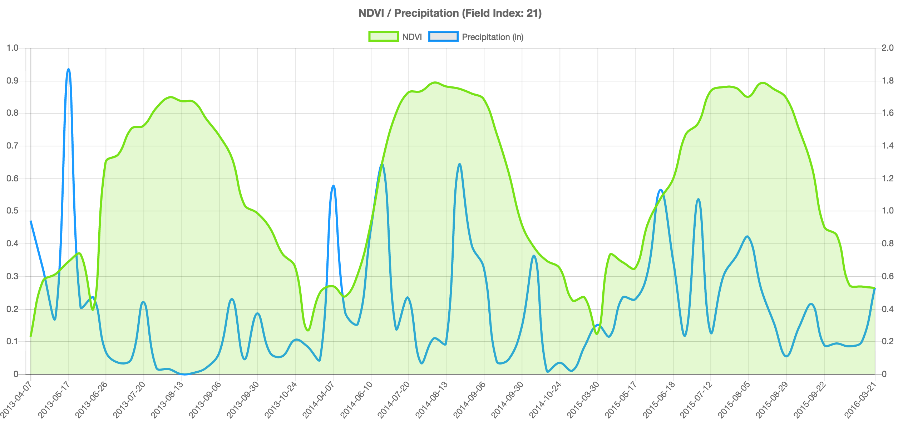

# Basic AstroDigital NDVI Values/ Precipitation Chart

###[Working Example](https://rawgit.com/AstroDigital/example-ndvi-chart-plus/master/example/index.html) | [Primary Code](https://github.com/AstroDigital/example-ndvi-chart-plus/blob/master/example/ad-ndvi-chart.js)

[](https://rawgit.com/AstroDigital/example-ndvi-chart-plus/master/example/index.html)

## Overview
This tutorial describes using NDVI values from the return of [Astro Digital's NDVI values API]((https://docs.astrodigital.com/docs/results)), along with precipitation values provided by NOAA, to create a chart of NDVI response as it relates to rainfall over time. There are many ways to approach this task, but we will use the open source [Chart.js](http://www.chartjs.org) library. Other topics in this tutorial series include:
- [Basic Astro Digital NDVI vector map setup](https://github.com/AstroDigital/example-ndvi-vector)
- [Symbolizing the NDVI vector product map](https://github.com/AstroDigital/example-ndvi-vector-symbology)
- [Synthesizing the vector and imagery NDVI products to create masked imagery](https://github.com/AstroDigital/example-field-mask) and

## Summary

The [Astro Digital NDVI values response](https://docs.astrodigital.com/docs/results) includes a `results` attribute, which is an array in which each feature represents an input polygon with an attribute array that lists the average NDVI measurements for that feature at various points in time. To prepare the data for charting, we will will discard the geometry and create an array of values representing only the value and date of each NDVI measurement for each feature.
```js
const ndviData = adNdviData.results.map((field) => {
  return field.value.properties.ndvi_values;
});
```

In order to demonstrate melding of datasources, we will include an array of precipitation values provided by NOAA. To match the NDVI values, Chart.js requires this array to have a one-to-one relationship with the dates in the NDVI array.
```js
const precipValues = noaaPrecipData.map((date) => date.value).reverse();
```

After formatting the datasource and defining chart options, we can instantiate a new Chart.js chart, the initial datasource of which is the NDVI values of the field at index 0. We will then increment through the values of other fields by using the chart's update method.
```js
var ctx = document.getElementById('chart');
var chart = new Chart(ctx, {
  type: 'line',
  data: chartData,
  options: chartOptions
});
```

Finally, we can add a bit of polish to this demo by cycling through the values of each feature, which also demonstrates the form used to update chart values. We'll do this through a setIncrement loop in order to pause between updates, as shown below:
```js
setInterval(() => {
  // Increment field, or repeat loop after all fields have been cycled through.
  fieldIndex = (fieldIndex < ndviData.length - 1) ? fieldIndex + 1 : 0;
  // Set the chart's title to reference the active field index.
  chart.options.title.text = `NDVI / Precipitation (Field Index: ${fieldIndex})`
  // Set the chart's NDVI values (at axis[0]) to reference the active field index.
  chart.data.datasets[0].data = ndviData[fieldIndex].map((field) => field.value).reverse();
  chart.update();
}, 500);
```

Check out [the source code for more details!](example/ad-ndvi-chart.js)
